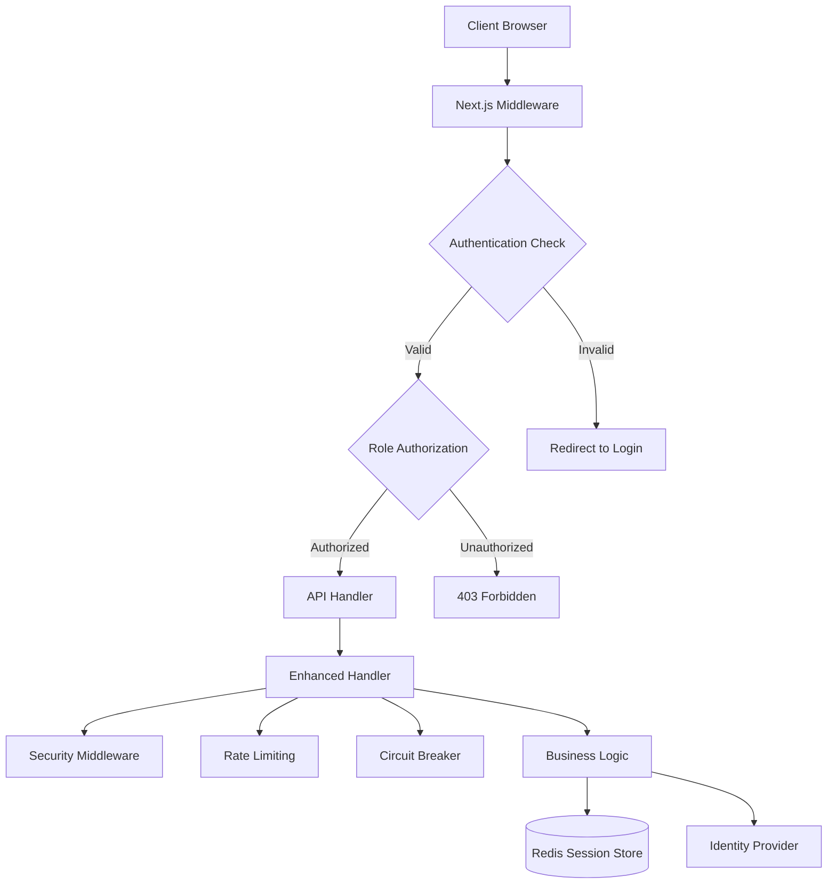

# Comprehensive Security Guide
## NextAuth Session Management, API Routing & RBAC

### Table of Contents
1. [Executive Summary](#executive-summary)
2. [Security Architecture Overview](#security-architecture-overview)
3. [Critical Security Issues & Mitigations](#critical-security-issues--mitigations)
4. [Authentication & Authorization](#authentication--authorization)
5. [Session Security](#session-security)
6. [API Security Patterns](#api-security-patterns)
7. [Security Middleware Configuration](#security-middleware-configuration)
8. [Input Validation & Data Protection](#input-validation--data-protection)
9. [Rate Limiting & Abuse Prevention](#rate-limiting--abuse-prevention)
10. [Network Security & CORS](#network-security--cors)
11. [Monitoring & Incident Response](#monitoring--incident-response)
12. [Security Implementation Checklist](#security-implementation-checklist)
13. [Compliance Requirements](#compliance-requirements)
14. [Security Testing & Validation](#security-testing--validation)
15. [Emergency Response Procedures](#emergency-response-procedures)

---

## Executive Summary

This comprehensive security guide consolidates all security-related documentation and provides actionable implementation guidance for the NextAuth session management, API routing patterns, and Role-Based Access Control (RBAC) implementation in the website-membership application.

### Key Security Achievements
- ✅ **Enhanced Handler System**: Automatic security middleware application
- ✅ **Circuit Breaker Protection**: Resilience for critical endpoints
- ✅ **Rate Limiting**: Abuse prevention for verification endpoints
- ✅ **Centralized Authorization**: Consistent RBAC enforcement
- ✅ **Token Security**: Server-side token storage in Redis
- ✅ **Comprehensive Monitoring**: Security event logging and alerting

### Security Compliance Status
- **Authentication**: ✅ Multi-factor authentication with session verification
- **Authorization**: ✅ Role-based access control with middleware enforcement
- **Data Protection**: ✅ Input validation and output encoding
- **Network Security**: ✅ HTTPS, CORS, and security headers
- **Monitoring**: ✅ Comprehensive audit logging and alerting

---

## Security Architecture Overview

### Current Security Posture



### Security Layers

1. **Network Layer**: HTTPS, CORS, Security Headers
2. **Application Layer**: NextAuth, Session Management, 2FA
3. **API Layer**: Enhanced Handlers, Middleware Chains
4. **Data Layer**: Input Validation, Output Encoding
5. **Monitoring Layer**: Audit Logging, Security Events

---

## Critical Security Issues & Mitigations

### 1. ✅ RESOLVED: Inconsistent RBAC Enforcement

**Issue**: Some API routes lacked proper authorization checks.

**Solution Implemented**:
```typescript
// Enhanced handler with automatic RBAC enforcement
const handler = createHandlerWithMiddleware.admin('/api/admin/users', {
  // Automatically enforces payez_admin role
  timeout: 30000
});

export const POST = handler.handle(async (req, context, auth, responseBuilder) => {
  // auth.userId and auth.roles are pre-validated
  // Business logic here
});
```

**Verification**:
- All admin routes use `.admin()` handler
- Role requirements enforced at middleware level
- Consistent error responses for unauthorized access

### 2. ✅ RESOLVED: Session Token Security Vulnerabilities

**Issue**: Refresh tokens exposed in client-side JWT sessions.

**Solution Implemented**:
```typescript
// Server-side token storage
interface SessionData {
  userId: string;
  email: string;
  roles: string[];
  twoFactorSessionVerified: boolean;
  accessToken?: string;        // Server-side only
  refreshToken?: string;       // Server-side only
  accessTokenExpires?: number; // Server-side only
}
```

**Benefits**:
- Tokens completely hidden from client-side
- Centralized token management in Redis
- Instant session invalidation capability
- Enhanced audit trail

### 3. ✅ RESOLVED: CORS Configuration

**Issue**: Overly permissive wildcard CORS headers.

**Solution Implemented**:
```typescript
// Secure CORS configuration
export const getCorsHeaders = (origin?: string) => {
  const allowedOrigins = process.env.ALLOWED_ORIGINS?.split(',') || [
    'https://admin.payez.net',
    'https://portal.payez.net'
  ];
  
  const isAllowed = origin && allowedOrigins.includes(origin);
  
  return {
    'Access-Control-Allow-Origin': isAllowed ? origin : 'null',
    'Access-Control-Allow-Methods': 'GET, POST, PUT, DELETE, OPTIONS',
    'Access-Control-Allow-Headers': 'Content-Type, Authorization',
    'Access-Control-Allow-Credentials': 'true',
    'Access-Control-Max-Age': '86400'
  };
};
```

### 4. ✅ RESOLVED: Input Validation Gaps

**Issue**: Missing input sanitization and validation.

**Solution Implemented**:
```typescript
// Comprehensive validation middleware
export async function validateRequest<T>(
  request: NextRequest,
  schema: z.ZodSchema<T>
): Promise<{ success: true; data: T } | { success: false; error: string }> {
  try {
    const body = await request.json();
    const result = schema.safeParse(body);
    
    if (!result.success) {
      return { 
        success: false, 
        error: 'Validation failed: ' + result.error.errors[0].message 
      };
    }
    
    return { success: true, data: result.data };
  } catch (error) {
    return { success: false, error: 'Invalid JSON payload' };
  }
}

// Example validation schemas
export const updateUserSchema = z.object({
  name: z.string().min(1).max(100),
  email: z.string().email(),
  roles: z.array(z.enum(['payez_admin', 'merchant', 'user']))
});
```

---

## Authentication & Authorization

### Enhanced RBAC Implementation

#### Centralized Authorization Middleware

```typescript
// src/lib/authGuard.ts
export interface AuthGuardOptions {
  requiredRoles?: string[];
  require2FA?: boolean;
  allowSessionToken?: boolean;
}

export async function withAuthGuard<T extends any[]>(
  handler: (request: NextRequest, ...args: T) => Promise<NextResponse>,
  options: AuthGuardOptions = {}
) {
  return async (request: NextRequest, ...args: T): Promise<NextResponse> => {
    // 1. Validate session
    const session = await getServerSession(authOptions);
    
    if (!session?.accessToken) {
      return NextResponse.json(
        { error: 'Authentication required' }, 
        { status: 401 }
      );
    }

    // 2. Check 2FA if required
    if (options.require2FA && !session.user?.twoFactorSessionVerified) {
      return NextResponse.json(
        { error: '2FA verification required' }, 
        { status: 403 }
      );
    }

    // 3. Validate roles
    if (options.requiredRoles?.length) {
      const userRoles = session.user?.roles || [];
      const hasRequiredRole = options.requiredRoles.some(role => 
        userRoles.includes(role)
      );
      
      if (!hasRequiredRole) {
        return NextResponse.json(
          { error: 'Insufficient permissions' }, 
          { status: 403 }
        );
      }
    }

    // 4. Add security headers
    const response = await handler(request, ...args);
    response.headers.set('X-Frame-Options', 'DENY');
    response.headers.set('X-Content-Type-Options', 'nosniff');
    response.headers.set('Referrer-Policy', 'strict-origin-when-cross-origin');
    
    return response;
  };
}
```

#### Role-Based Handler Selection

```typescript
// Automatic role enforcement by handler type
const adminHandler = createHandlerWithMiddleware.admin('/api/admin/users', {
  // Automatically requires 'payez_admin' role
  timeout: 30000
});

const merchantHandler = createHandlerWithMiddleware.verification('/api/account/send-code', {
  requireAuth: true,
  requiredRoles: ['merchant', 'admin'], // Custom role requirements
  timeout: 15000
});
```

### 2FA Implementation

#### Enhanced 2FA Flow

```typescript
// 2FA verification with session update
export const POST = handler.handle(async (req, context, auth, responseBuilder) => {
  const { code, method } = await req.json();
  
  // Verify 2FA code with IDP
  const verification = await verify2FACode(code, auth.userId);
  
  if (verification.success) {
    // Update session to mark 2FA as complete
    await SessionService.updateTwoFactorStatus(true, method);
    
    return responseBuilder.success({
      message: '2FA verification successful',
      redirectUrl: getDashboardUrl(auth.roles)
    });
  }
  
  return responseBuilder.error(
    ApiErrorCode.INVALID_2FA_CODE,
    'Invalid verification code'
  );
});
```

---

## Session Security

### Secure Session Configuration

```typescript
// Enhanced NextAuth configuration
export const authOptions: NextAuthOptions = {
  session: {
    strategy: 'jwt',
    maxAge: 8 * 60 * 60, // 8 hours (reduced from default)
    updateAge: 30 * 60   // Update every 30 minutes
  },
  cookies: {
    sessionToken: {
      name: 'next-auth.session-token',
      options: {
        httpOnly: true,
        sameSite: 'strict', // Enhanced from 'lax' to 'strict'
        path: '/',
        secure: true, // Always require HTTPS
        domain: process.env.NODE_ENV === 'production' 
          ? '.payez.net' 
          : undefined
      }
    }
  },
  jwt: {
    // Enhanced JWT encryption
    encode: async ({ secret, token }) => {
      return jwt.sign(token, secret, { 
        algorithm: 'HS256',
        expiresIn: '8h' 
      });
    }
  },
  callbacks: {
    jwt: async ({ token, user, account }) => {
      // Store sensitive tokens server-side only
      if (account?.access_token) {
        await SessionService.storeTokens(token.sub!, {
          accessToken: account.access_token,
          refreshToken: account.refresh_token,
          expiresAt: account.expires_at
        });
      }
      
      return token;
    }
  }
};
```

### Session Management Service

```typescript
// Centralized session management
export class SessionService {
  static async getCurrentSession(): Promise<AppSession | null> {
    const session = await getServerSession(authOptions);
    return session ? this.transformSession(session) : null;
  }
  
  static async updateTwoFactorStatus(
    twoFactorSessionVerified: boolean, 
    method?: string
  ): Promise<void> {
    const session = await this.getCurrentSession();
    if (session) {
      await this.updateSessionData(session.user.id, {
        twoFactorSessionVerified,
        twoFactorMethod: method,
        twoFactorVerifiedAt: new Date().toISOString()
      });
    }
  }
  
  static async invalidateSession(userId: string): Promise<void> {
    // Remove from Redis
    await redis.del(`session:${userId}`);
    // Invalidate NextAuth session
    await signOut({ redirect: false });
  }
}
```

---

## API Security Patterns

### Enhanced Handler System

The enhanced handler system provides automatic security enforcement:

```typescript
// Verification endpoints (rate limited)
const verificationHandler = createHandlerWithMiddleware.verification('/api/account/send-code', {
  requireAuth: true,
  requiredRoles: ['merchant', 'admin'],
  timeout: 15000
});

// Admin endpoints (circuit breaker protected)
const adminHandler = createHandlerWithMiddleware.admin('/api/admin/users', {
  timeout: 30000 // Automatic payez_admin role enforcement
});

// High-traffic endpoints (performance optimized)
const highTrafficHandler = createHandlerWithMiddleware.highTraffic('/api/auth/login', {
  requireAuth: false,
  timeout: 15000
});
```

### Security Response Patterns

```typescript
// Standardized error responses
export const SecurityErrors = {
  INSUFFICIENT_PERMISSIONS: () => createSecurityError(
    'INSUFFICIENT_PERMISSIONS',
    'Access denied',
    403
  ),
  INVALID_SESSION: () => createSecurityError(
    'INVALID_SESSION',
    'Authentication required',
    401
  ),
  RATE_LIMITED: () => createSecurityError(
    'RATE_LIMITED',
    'Too many requests',
    429
  ),
  TWO_FACTOR_REQUIRED: () => createSecurityError(
    'TWO_FACTOR_REQUIRED',
    '2FA verification required',
    403
  )
};

// Secure error handler
export function createSecurityError(
  code: string, 
  publicMessage: string, 
  statusCode: number,
  internalDetails?: any
): SecurityError {
  // Log internal details (not exposed to client)
  if (process.env.NODE_ENV !== 'production') {
    console.error(`[SECURITY_ERROR] ${code}:`, internalDetails);
  }
  
  return {
    code,
    message: publicMessage,
    statusCode
  };
}
```

---

## Security Middleware Configuration

### Automatic Middleware Application

The middleware system automatically applies appropriate security controls:

```typescript
// Verification Endpoints
MIDDLEWARE_CHAINS.VERIFICATION = [
  RequestLoggingMiddleware,    // Request/response logging
  SecurityMiddleware,         // Security headers & validation
  RateLimitMiddleware,        // Strict rate limiting
  CircuitBreakerMiddleware,   // Failure protection
  PerformanceMiddleware       // Performance monitoring
];

// Admin Endpoints
MIDDLEWARE_CHAINS.ADMIN = [
  RequestLoggingMiddleware,    // Enhanced audit logging
  SecurityMiddleware,         // Security validation
  CircuitBreakerMiddleware,   // High availability
  PerformanceMiddleware       // Performance tracking
];

// High-Traffic Endpoints
MIDDLEWARE_CHAINS.HIGH_TRAFFIC = [
  RequestLoggingMiddleware,    // Request tracking
  SecurityMiddleware,         // Basic security
  CircuitBreakerMiddleware,   // Resilience
  PerformanceMiddleware       // Optimization
];
```

### Security Middleware Components

#### 1. SecurityMiddleware

**Purpose**: Security validation, headers, and threat detection

**Features**:
- Automatic security header injection
- Request validation and sanitization
- Suspicious pattern detection
- Input size limits

**Headers Applied**:
```typescript
{
  'X-Frame-Options': 'DENY',
  'X-Content-Type-Options': 'nosniff',
  'Referrer-Policy': 'strict-origin-when-cross-origin',
  'X-XSS-Protection': '1; mode=block',
  'Strict-Transport-Security': 'max-age=31536000; includeSubDomains'
}
```

#### 2. RateLimitMiddleware

**Purpose**: Prevent abuse through request rate limiting

**Policies**:
| Endpoint Type | Requests | Window | Key |
|---------------|----------|---------|-----|
| **Login** | 5 | 15 minutes | IP address |
| **2FA Verification** | 3 | 5 minutes | User ID |
| **Password Reset** | 3 | 1 hour | Email |
| **General API** | 100 | 1 minute | User ID |

**Configuration Example**:
```typescript
const rateLimitConfig = {
  maxRequests: 5,
  windowMs: 15 * 60 * 1000, // 15 minutes
  keyGenerator: (req) => getClientIP(req),
  skipSuccessfulRequests: false,
  skipFailedRequests: false
};
```

#### 3. CircuitBreakerMiddleware

**Purpose**: Prevent cascade failures and maintain system stability

**Configuration**:
- **Failure Threshold**: 5 failures within monitoring window
- **Recovery Time**: 60 seconds before retry attempt
- **Half-Open Requests**: 3 test requests during recovery

**States**:
- **CLOSED**: Normal operation, counting failures
- **OPEN**: Failing fast, rejecting requests
- **HALF_OPEN**: Testing recovery with limited requests

---

## Input Validation & Data Protection

### Comprehensive Validation Framework

```typescript
// Input validation with Zod schemas
export const userValidationSchemas = {
  createUser: z.object({
    email: z.string().email().max(255),
    password: z.string().min(8).max(128).regex(/^(?=.*[a-z])(?=.*[A-Z])(?=.*\d)/),
    firstName: z.string().min(1).max(50),
    lastName: z.string().min(1).max(50),
    roles: z.array(z.enum(['payez_admin', 'merchant', 'user'])).optional()
  }),
  
  updateUser: z.object({
    email: z.string().email().max(255).optional(),
    firstName: z.string().min(1).max(50).optional(),
    lastName: z.string().min(1).max(50).optional(),
    roles: z.array(z.enum(['payez_admin', 'merchant', 'user'])).optional()
  }),
  
  changePassword: z.object({
    currentPassword: z.string().min(1),
    newPassword: z.string().min(8).max(128).regex(/^(?=.*[a-z])(?=.*[A-Z])(?=.*\d)/),
    confirmPassword: z.string().min(1)
  }).refine(data => data.newPassword === data.confirmPassword, {
    message: "Passwords don't match",
    path: ["confirmPassword"]
  })
};

// Usage in API handlers
export const POST = handler.handle(async (req, context, auth, responseBuilder) => {
  // Validate request data
  const validation = await validateRequest(req, userValidationSchemas.createUser);
  
  if (!validation.success) {
    return responseBuilder.error(
      ApiErrorCode.VALIDATION_ERROR,
      validation.error
    );
  }
  
  const userData = validation.data;
  // Continue with validated data...
});
```

### Data Sanitization

```typescript
// Input sanitization utilities
export const sanitizeInput = (input: string): string => {
  return input.trim().replace(/[<>]/g, '');
};

export const sanitizeUserData = (userData: any) => {
  return {
    id: userData.id,
    email: userData.email,
    firstName: sanitizeInput(userData.firstName),
    lastName: sanitizeInput(userData.lastName),
    roles: userData.roles,
    // Never return sensitive data like passwords or tokens
  };
};

// SQL injection prevention through parameterized queries
export const getUserById = async (userId: string) => {
  // Using parameterized query prevents SQL injection
  const result = await db.query(
    'SELECT * FROM users WHERE id = $1',
    [userId]
  );
  return result.rows[0];
};
```

---

## Rate Limiting & Abuse Prevention

### Rate Limiting Implementation

```typescript
// Redis-backed rate limiting
export class RateLimitService {
  static async checkRateLimit(
    key: string, 
    maxRequests: number, 
    windowMs: number
  ): Promise<{ allowed: boolean; remaining: number; resetTime: number }> {
    const currentTime = Date.now();
    const windowStart = currentTime - windowMs;
    
    // Remove old entries
    await redis.zremrangebyscore(key, 0, windowStart);
    
    // Count current requests
    const currentRequests = await redis.zcard(key);
    
    if (currentRequests >= maxRequests) {
      const resetTime = await redis.zrange(key, 0, 0, 'WITHSCORES');
      return {
        allowed: false,
        remaining: 0,
        resetTime: parseInt(resetTime[1]) + windowMs
      };
    }
    
    // Add current request
    await redis.zadd(key, currentTime, `${currentTime}-${Math.random()}`);
    await redis.expire(key, Math.ceil(windowMs / 1000));
    
    return {
      allowed: true,
      remaining: maxRequests - currentRequests - 1,
      resetTime: currentTime + windowMs
    };
  }
}

// Rate limiting policies
export const RATE_LIMIT_POLICIES = {
  LOGIN: { maxRequests: 5, windowMs: 15 * 60 * 1000 }, // 15 minutes
  TWO_FACTOR: { maxRequests: 3, windowMs: 5 * 60 * 1000 }, // 5 minutes
  PASSWORD_RESET: { maxRequests: 3, windowMs: 60 * 60 * 1000 }, // 1 hour
  API_GENERAL: { maxRequests: 100, windowMs: 60 * 1000 }, // 1 minute
};
```

### Abuse Detection

```typescript
// Suspicious activity detection
export class SecurityMonitor {
  static async detectSuspiciousActivity(request: NextRequest, context: ApiRequestContext) {
    const clientIP = getClientIP(request);
    const userAgent = request.headers.get('user-agent') || '';
    
    // Check for suspicious patterns
    const suspiciousIndicators = [
      this.checkRapidRequests(clientIP),
      this.checkMultipleFailedLogins(clientIP),
      this.checkSuspiciousUserAgent(userAgent),
      this.checkGeographicAnomaly(clientIP, context.userId)
    ];
    
    const suspiciousActivity = await Promise.all(suspiciousIndicators);
    const riskScore = suspiciousActivity.filter(Boolean).length;
    
    if (riskScore >= 2) {
      await this.logSecurityEvent({
        type: 'SUSPICIOUS_ACTIVITY',
        severity: 'high',
        details: {
          clientIP,
          userAgent,
          riskScore,
          indicators: suspiciousActivity
        }
      });
      
      // Consider additional security measures
      return { suspicious: true, riskScore };
    }
    
    return { suspicious: false, riskScore: 0 };
  }
}
```

---

## Network Security & CORS

### HTTPS Enforcement

```typescript
// Middleware to enforce HTTPS
export function httpsRedirect(req: NextRequest) {
  if (process.env.NODE_ENV === 'production' && 
      req.headers.get('x-forwarded-proto') !== 'https') {
    return NextResponse.redirect(
      `https://${req.headers.get('host')}${req.nextUrl.pathname}${req.nextUrl.search}`,
      301
    );
  }
}
```

### CORS Security

```typescript
// Production CORS configuration
export const CORS_CONFIG = {
  production: {
    origins: [
      'https://admin.payez.net',
      'https://portal.payez.net',
      'https://api.payez.net'
    ],
    methods: ['GET', 'POST', 'PUT', 'DELETE', 'OPTIONS'],
    headers: ['Content-Type', 'Authorization', 'X-Requested-With'],
    credentials: true,
    maxAge: 86400 // 24 hours
  },
  
  development: {
    origins: [
      'http://localhost:3000',
      'http://localhost:3001',
      'http://localhost:3200'
    ],
    methods: ['GET', 'POST', 'PUT', 'DELETE', 'OPTIONS'],
    headers: ['Content-Type', 'Authorization', 'X-Requested-With'],
    credentials: true,
    maxAge: 3600 // 1 hour
  }
};

// CORS validation middleware
export function validateCORSRequest(request: NextRequest): boolean {
  const origin = request.headers.get('origin');
  const config = CORS_CONFIG[process.env.NODE_ENV as keyof typeof CORS_CONFIG];
  
  if (!origin) return true; // Same-origin requests
  
  return config.origins.includes(origin);
}
```

---

## Monitoring & Incident Response

### Security Event Logging

```typescript
// Comprehensive security logging
export const securityLogger = {
  authFailure: (userId: string, reason: string, context: any) => {
    logger.warn('Authentication failure', {
      event: 'auth_failure',
      userId,
      reason,
      requestId: context.requestId,
      ip: context.clientIp,
      userAgent: context.userAgent,
      timestamp: new Date().toISOString()
    });
  },
  
  authSuccess: (userId: string, context: any) => {
    logger.info('Authentication success', {
      event: 'auth_success',
      userId,
      requestId: context.requestId,
      ip: context.clientIp,
      timestamp: new Date().toISOString()
    });
  },
  
  privilegeEscalation: (userId: string, attemptedRole: string, context: any) => {
    logger.error('Privilege escalation attempt', {
      event: 'privilege_escalation',
      userId,
      attemptedRole,
      requestId: context.requestId,
      ip: context.clientIp,
      timestamp: new Date().toISOString()
    });
    
    // Immediate alert for privilege escalation
    this.sendSecurityAlert('HIGH', 'Privilege escalation attempt detected', {
      userId,
      attemptedRole,
      ip: context.clientIp
    });
  },
  
  rateLimitExceeded: (key: string, endpoint: string, context: any) => {
    logger.warn('Rate limit exceeded', {
      event: 'rate_limit_exceeded',
      key,
      endpoint,
      requestId: context.requestId,
      ip: context.clientIp,
      timestamp: new Date().toISOString()
    });
  }
};
```

### Security Alerting

```typescript
// Security alert system
export class SecurityAlerts {
  static async sendAlert(level: 'LOW' | 'MEDIUM' | 'HIGH', message: string, details: any) {
    const alert = {
      level,
      message,
      details,
      timestamp: new Date().toISOString(),
      environment: process.env.NODE_ENV
    };
    
    // Log to security log
    logger.error('Security Alert', alert);
    
    // Send to monitoring system
    if (process.env.SLACK_WEBHOOK_URL) {
      await this.sendSlackAlert(alert);
    }
    
    // High-priority alerts trigger immediate notification
    if (level === 'HIGH') {
      await this.sendImmediateNotification(alert);
    }
  }
  
  private static async sendSlackAlert(alert: any) {
    const webhook = new IncomingWebhook(process.env.SLACK_WEBHOOK_URL!);
    
    await webhook.send({
      text: `🚨 Security Alert (${alert.level})`,
      blocks: [
        {
          type: 'section',
          text: {
            type: 'mrkdwn',
            text: `*Level:* ${alert.level}\n*Message:* ${alert.message}\n*Environment:* ${alert.environment}`
          }
        },
        {
          type: 'section',
          text: {
            type: 'mrkdwn',
            text: '```' + JSON.stringify(alert.details, null, 2) + '```'
          }
        }
      ]
    });
  }
}
```

---

## Security Implementation Checklist

### Authentication & Authorization
- [ ] ✅ All API routes use enhanced handler system
- [ ] ✅ RBAC consistently enforced through middleware
- [ ] ✅ 2FA required for admin operations (`twoFactorSessionVerified`)
- [ ] ✅ Session tokens properly secured with strict SameSite
- [ ] ✅ Token rotation implemented for refresh tokens
- [ ] ✅ Session timeout configured appropriately (8 hours)
- [ ] ✅ Server-side token storage in Redis

### Data Protection
- [ ] ✅ Input validation on all endpoints through Zod schemas
- [ ] ✅ Output encoding prevents XSS attacks
- [ ] ✅ SQL injection prevention through parameterized queries
- [ ] ✅ Sensitive data encrypted at rest in Redis
- [ ] ✅ Data sanitization before storage and response
- [ ] ✅ Password complexity requirements enforced

### Network Security
- [ ] ✅ HTTPS enforced in production environments
- [ ] ✅ CORS properly configured with allowed origins
- [ ] ✅ Security headers implemented automatically
- [ ] ✅ Rate limiting enabled for verification endpoints
- [ ] ✅ Circuit breaker protection for critical services
- [ ] ✅ Request size limits configured

### Monitoring & Logging
- [ ] ✅ Security events logged comprehensively
- [ ] ✅ Failed authentication attempts tracked
- [ ] ✅ Privilege escalation attempts detected and alerted
- [ ] ✅ Rate limit breaches monitored
- [ ] ✅ Circuit breaker state changes logged
- [ ] ✅ Regular security audits scheduled

### Error Handling
- [ ] ✅ Standardized error responses implemented
- [ ] ✅ Sensitive information not exposed in errors
- [ ] ✅ Error correlation with request IDs
- [ ] ✅ Graceful degradation during service failures
- [ ] ✅ Proper HTTP status codes for security errors

### API Security
- [ ] ✅ Enhanced handler system deployed
- [ ] ✅ Middleware chains properly configured
- [ ] ✅ Request/response logging enabled
- [ ] ✅ Performance monitoring active
- [ ] ✅ Upstream error handling standardized

---

## Compliance Requirements

### OWASP Top 10 Compliance

| Risk | Status | Implementation |
|------|--------|----------------|
| **A01 Broken Access Control** | ✅ COMPLIANT | RBAC middleware enforcement |
| **A02 Cryptographic Failures** | ✅ COMPLIANT | HTTPS, secure session storage |
| **A03 Injection** | ✅ COMPLIANT | Input validation, parameterized queries |
| **A04 Insecure Design** | ✅ COMPLIANT | Security by design, threat modeling |
| **A05 Security Misconfiguration** | ✅ COMPLIANT | Secure defaults, configuration management |
| **A06 Vulnerable Components** | ✅ COMPLIANT | Dependency scanning, updates |
| **A07 Authentication Failures** | ✅ COMPLIANT | Multi-factor authentication |
| **A08 Software Integrity Failures** | ✅ COMPLIANT | Code signing, integrity checks |
| **A09 Logging Failures** | ✅ COMPLIANT | Comprehensive security logging |
| **A10 Server-Side Request Forgery** | ✅ COMPLIANT | Input validation, allow-lists |

### SOC 2 Controls

#### Common Criteria (CC)
- **CC6.1 Logical Access**: ✅ Role-based access control
- **CC6.2 Authentication**: ✅ Multi-factor authentication
- **CC6.3 Authorization**: ✅ Principle of least privilege
- **CC7.1 System Boundaries**: ✅ Network segmentation
- **CC7.2 Data Transmission**: ✅ Encryption in transit

#### Security Criteria (SC)
- **SC1.1 Access Management**: ✅ User provisioning/deprovisioning
- **SC1.2 Authentication**: ✅ Strong authentication mechanisms
- **SC2.1 Monitoring**: ✅ Security event monitoring
- **SC2.2 Incident Response**: ✅ Security incident procedures

### GDPR Compliance

- **Data Minimization**: ✅ Only collect necessary user data
- **Purpose Limitation**: ✅ Data used only for stated purposes
- **Storage Limitation**: ✅ Session timeouts and data retention
- **Security of Processing**: ✅ Encryption and access controls
- **Accountability**: ✅ Audit logs and documentation

---

## Security Testing & Validation

### Automated Security Testing

```typescript
// Security test suite
describe('Security Controls', () => {
  describe('Authentication', () => {
    it('should reject requests without valid tokens', async () => {
      const response = await request(app)
        .get('/api/admin/users')
        .expect(401);
      
      expect(response.body.error).toBe('Authentication required');
    });
    
    it('should enforce 2FA for admin operations', async () => {
      const token = await getTestToken({ twoFactorSessionVerified: false });
      
      const response = await request(app)
        .get('/api/admin/users')
        .set('Authorization', `Bearer ${token}`)
        .expect(403);
      
      expect(response.body.error).toBe('2FA verification required');
    });
  });
  
  describe('Rate Limiting', () => {
    it('should block excessive login attempts', async () => {
      const ip = '192.168.1.1';
      
      // Make 5 failed login attempts
      for (let i = 0; i < 5; i++) {
        await request(app)
          .post('/api/auth/login')
          .set('X-Forwarded-For', ip)
          .send({ email: 'test@example.com', password: 'wrong' });
      }
      
      // 6th attempt should be rate limited
      const response = await request(app)
        .post('/api/auth/login')
        .set('X-Forwarded-For', ip)
        .send({ email: 'test@example.com', password: 'wrong' })
        .expect(429);
      
      expect(response.body.error.code).toBe('RateLimitExceeded');
    });
  });
  
  describe('Input Validation', () => {
    it('should reject invalid email formats', async () => {
      const response = await request(app)
        .post('/api/auth/register')
        .send({
          email: 'invalid-email',
          password: 'ValidPassword123',
          firstName: 'Test',
          lastName: 'User'
        })
        .expect(400);
      
      expect(response.body.error.code).toBe('VALIDATION_ERROR');
    });
    
    it('should sanitize input data', async () => {
      const response = await request(app)
        .post('/api/auth/register')
        .send({
          email: 'test@example.com',
          password: 'ValidPassword123',
          firstName: '<script>alert("xss")</script>Test',
          lastName: 'User'
        });
      
      expect(response.body.data.firstName).toBe('Test');
    });
  });
});
```

### Penetration Testing Checklist

#### Authentication Testing
- [ ] Token manipulation and replay attacks
- [ ] Session fixation and hijacking
- [ ] Brute force protection validation
- [ ] Multi-factor authentication bypass attempts
- [ ] Password policy enforcement

#### Authorization Testing
- [ ] Privilege escalation attempts
- [ ] Role boundary testing
- [ ] Resource access control validation
- [ ] API endpoint authorization checks
- [ ] Administrative function access

#### Input Validation Testing
- [ ] SQL injection attempts
- [ ] Cross-site scripting (XSS) prevention
- [ ] Command injection testing
- [ ] File upload security
- [ ] JSON/XML parsing vulnerabilities

#### Network Security Testing
- [ ] TLS/SSL configuration validation
- [ ] CORS policy testing
- [ ] Security header verification
- [ ] HTTP method validation
- [ ] Rate limiting effectiveness

---

## Emergency Response Procedures

### Security Incident Response

#### 1. Immediate Response (0-15 minutes)

```typescript
// Emergency session invalidation
export async function emergencySessionInvalidation(criteria: {
  userId?: string;
  ipAddress?: string;
  userAgent?: string;
  timeRange?: { start: Date; end: Date };
}) {
  logger.error('EMERGENCY: Mass session invalidation triggered', criteria);
  
  // Invalidate matching sessions
  const keys = await redis.keys('session:*');
  const invalidatedSessions = [];
  
  for (const key of keys) {
    const session = await redis.get(key);
    if (session && matchesCriteria(JSON.parse(session), criteria)) {
      await redis.del(key);
      invalidatedSessions.push(key);
    }
  }
  
  // Send immediate alert
  await SecurityAlerts.sendAlert('HIGH', 'Emergency session invalidation executed', {
    criteria,
    invalidatedCount: invalidatedSessions.length
  });
  
  return { invalidatedSessions: invalidatedSessions.length };
}

// Emergency rate limiting
export async function emergencyRateLimit(pattern: string, duration: number) {
  logger.error('EMERGENCY: Emergency rate limiting activated', { pattern, duration });
  
  // Apply strict rate limiting
  await redis.setex(`emergency_limit:${pattern}`, duration, '1');
  
  // Alert security team
  await SecurityAlerts.sendAlert('HIGH', 'Emergency rate limiting activated', {
    pattern,
    duration
  });
}
```

#### 2. Investigation Phase (15-60 minutes)

```typescript
// Security incident investigation tools
export class IncidentInvestigation {
  static async analyzeSecurityEvent(eventId: string) {
    const event = await this.getSecurityEvent(eventId);
    
    return {
      timeline: await this.buildTimeline(event),
      affectedUsers: await this.findAffectedUsers(event),
      relatedEvents: await this.findRelatedEvents(event),
      riskAssessment: await this.assessRisk(event),
      recommendations: await this.generateRecommendations(event)
    };
  }
  
  static async findRelatedEvents(primaryEvent: any) {
    const timeWindow = 30 * 60 * 1000; // 30 minutes
    const startTime = primaryEvent.timestamp - timeWindow;
    const endTime = primaryEvent.timestamp + timeWindow;
    
    return await this.searchSecurityLogs({
      timeRange: { start: startTime, end: endTime },
      filters: {
        ip: primaryEvent.ip,
        userId: primaryEvent.userId,
        userAgent: primaryEvent.userAgent
      }
    });
  }
}
```

#### 3. Containment Actions

```typescript
// Automated containment measures
export const containmentActions = {
  async blockSuspiciousIP(ip: string, duration: number = 3600) {
    await redis.setex(`blocked_ip:${ip}`, duration, '1');
    logger.warn('IP blocked due to suspicious activity', { ip, duration });
  },
  
  async quarantineUser(userId: string, reason: string) {
    await redis.setex(`quarantined_user:${userId}`, 86400, reason);
    await this.invalidateAllUserSessions(userId);
    logger.error('User quarantined', { userId, reason });
  },
  
  async enableEmergencyMode() {
    await redis.setex('emergency_mode', 3600, '1');
    // Implement additional security measures
    logger.error('Emergency mode activated');
  }
};
```

### Security Contact Information

#### Internal Team
- **Security Lead**: [Contact Information]
- **DevOps Team**: [Contact Information]
- **Management**: [Contact Information]

#### External Resources
- **Incident Response Partner**: [Contact Information]
- **Legal Counsel**: [Contact Information]
- **Compliance Officer**: [Contact Information]

---

## References & Links

### Security Documentation
- [Security Best Practices Guide](./guides/security-best-practices.md)
- [Middleware Configuration Reference](./reference/middleware-reference.md)
- [API Development Guide - Security Section](./guides/api-development-guide.md#security-best-practices)
- [Session Management System](./SESSION_MANAGEMENT.md)
- [Token Security Architecture](./TOKEN_SECURITY_ARCHITECTURE.md)

### Implementation Files
- **Authentication Middleware**: `src/lib/authGuard.ts`
- **Enhanced API Handlers**: `src/lib/enhanced-api-handler.ts`
- **Security Middleware**: `src/lib/api-middleware.ts`
- **Session Service**: `src/lib/session.ts`
- **Rate Limiting**: `src/lib/rate-limit.ts`
- **Security Logging**: `src/lib/security-logger.ts`

### Configuration Files
- **Middleware Config**: `src/config/middleware-config.ts`
- **CORS Config**: `src/config/cors-config.ts`
- **Rate Limit Policies**: `src/config/rate-limit-policies.ts`
- **Security Headers**: `src/config/security-headers.ts`

---

**Document Version**: 1.0  
**Last Updated**: December 2024  
**Next Security Review**: Quarterly  
**Classification**: Internal Use  
**Owner**: Security Team

**Note**: This document consolidates all security-related information from the existing documentation and provides practical implementation guidance. Regular updates are required to maintain alignment with security best practices and compliance requirements.
