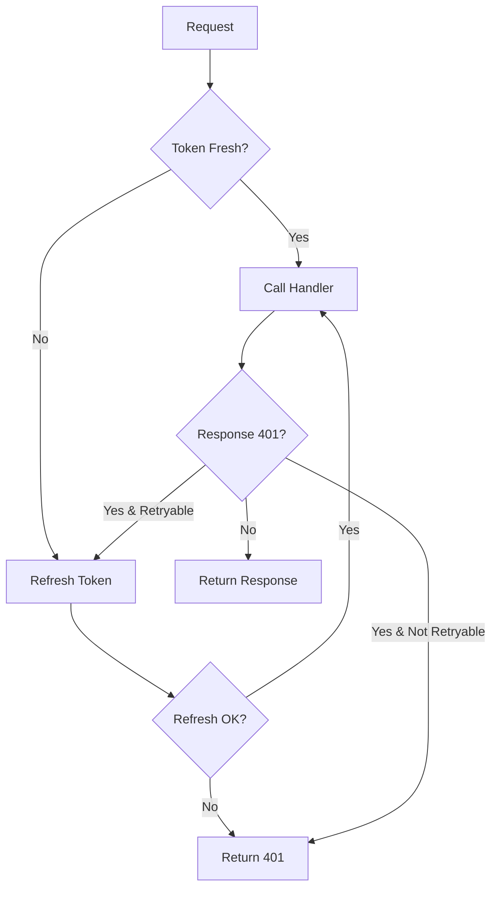

# Spec: @payez/next-mvp Auth-Ready v2.0

## Executive Summary

Transform @payez/next-mvp from a "building blocks" package to a truly "auth-ready" solution that requires minimal setup and automatically handles token lifecycle management.

## Current State Analysis

### What Works Well ✅
- Core refresh logic (`createRefreshHandler`)
- Session management with Redis
- Token validation utilities
- Middleware decision logic
- Single-use refresh token handling

### Pain Points ❌
1. **Manual token refresh** - Each app must implement expiry checking
2. **Route creation burden** - Apps create 5+ route files manually
3. **No auto-retry on 401** - Apps handle token expiry themselves
4. **Complex initial setup** - Too many steps to get working auth

## Proposed Changes

### 1. Enhanced API Handler (Priority: HIGH)

#### New Export: `createAuthHandler`

```typescript
// @payez/next-mvp/api/auth-handler
export interface AuthHandlerOptions {
  requireAuth?: boolean
  autoRefresh?: boolean // Default: true
  refreshBuffer?: number // Default: 5 minutes
  retryOn401?: boolean // Default: true
  maxRetries?: number // Default: 1
}

export function createAuthHandler(options: AuthHandlerOptions) {
  return {
    handle: (handler: HandlerFunction) => async (req: NextRequest) => {
      // 1. Extract token
      // 2. Check expiry
      // 3. Auto-refresh if needed
      // 4. Call handler
      // 5. Retry on 401 if token was refreshed
      // 6. Return response
    }
  }
}
```

#### Usage in Apps:
```typescript
// Simple as this!
import { createAuthHandler } from '@payez/next-mvp/api'

const handler = createAuthHandler({ requireAuth: true })

export const GET = handler.handle(async (req, context, auth) => {
  // Token is ALWAYS fresh here
  return { data: 'protected' }
})
```

### 2. Ready-to-Use Route Exports (Priority: HIGH)

#### New Route Modules:

```typescript
// @payez/next-mvp/routes/auth/refresh
export const POST = createRefreshHandler({
  idpBaseUrl: process.env.IDP_BASE_URL,
  clientId: process.env.CLIENT_ID,
  nextAuthSecret: process.env.NEXTAUTH_SECRET
})

// @payez/next-mvp/routes/auth/session
export { GET, POST } from './session-handler'

// @payez/next-mvp/routes/auth/logout
export { POST } from './logout-handler'
```

#### App Usage:
```typescript
// app/api/auth/refresh/route.ts
export { POST } from '@payez/next-mvp/routes/auth/refresh'
// That's it! One line!
```

### 3. CLI Scaffolding Tool (Priority: MEDIUM)

#### New CLI Command:

```bash
npx @payez/next-mvp init [options]

Options:
  --app-dir <path>     App directory path (default: ./src/app)
  --with-examples      Include example protected routes
  --force              Overwrite existing files
```

#### What It Creates:
```
src/app/api/
├── auth/
│   ├── refresh/route.ts       # One-line re-export
│   ├── session/route.ts       # One-line re-export
│   ├── logout/route.ts        # One-line re-export
│   └── [...nextauth]/route.ts # NextAuth handler
├── session/
│   └── viability/route.ts     # One-line re-export
└── examples/                   # If --with-examples
    └── protected/route.ts      # Example using createAuthHandler
```

### 4. Backward Compatibility Strategy

#### Phase 1: Non-Breaking Additions (v2.1.0)
- ADD new `createAuthHandler` alongside existing exports
- ADD route modules as new exports
- KEEP all existing exports unchanged
- Apps can opt-in gradually

#### Phase 2: Migration Helpers (v2.2.0)
- ADD migration guide with codemods
- ADD compatibility warnings for old patterns
- PROVIDE automated migration script

#### Phase 3: Deprecation (v3.0.0)
- DEPRECATE old patterns (with warnings)
- All apps should be migrated by now

### 5. Implementation Plan

#### Week 1: Core Auth Handler
- [ ] Implement `createAuthHandler` with auto-refresh
- [ ] Add retry-on-401 logic
- [ ] Write comprehensive tests
- [ ] Update types for better DX

#### Week 2: Route Exports
- [ ] Create route modules for all auth endpoints
- [ ] Add configuration via environment variables
- [ ] Test with existing apps (website-membership)
- [ ] Document usage patterns

#### Week 3: CLI Tool
- [ ] Build init command with file generation
- [ ] Add interactive mode for configuration
- [ ] Create templates for different setups
- [ ] Add --dry-run option for preview

#### Week 4: Testing & Documentation
- [ ] Integration tests with real IDP
- [ ] Migration guide for existing apps
- [ ] Update README with new patterns
- [ ] Create example Next.js app

## Migration Examples

### Before (Current Painful Way):
```typescript
// 1. Create api-handler.ts (100+ lines)
// 2. Create refresh route
// 3. Add token checking logic
// 4. Handle refresh manually
// 5. Wire up all routes
// ... lots of boilerplate
```

### After (New Easy Way):
```bash
# One command
npx @payez/next-mvp init

# Use in routes
import { createAuthHandler } from '@payez/next-mvp/api'
const handler = createAuthHandler({ requireAuth: true })
export const GET = handler.handle(async (req) => {
  return { data: 'protected' }
})
```

## Success Metrics

1. **Setup time:** From hours to < 5 minutes
2. **Lines of code:** Reduce auth boilerplate by 90%
3. **Bug reduction:** Centralized refresh = fewer bugs
4. **Adoption:** All new projects use v2 patterns

## Risk Mitigation

### Risk: Breaking existing apps
**Mitigation:** Careful backward compatibility, extensive testing

### Risk: Complex migration
**Mitigation:** Automated migration tools, clear guides

### Risk: Performance impact
**Mitigation:** Benchmark auto-refresh, add caching

## Technical Design Details

### Auto-Refresh Flow


### File Structure
```
packages/next-mvp/
├── src/
│   ├── api/
│   │   ├── auth-handler.ts      # NEW: Auto-refreshing handler
│   │   └── index.ts              # Re-exports
│   ├── routes/                   # NEW: Ready-to-use routes
│   │   └── auth/
│   │       ├── refresh.ts
│   │       ├── session.ts
│   │       └── logout.ts
│   ├── cli/                      # NEW: CLI tool
│   │   ├── init.ts
│   │   └── templates/
│   └── [existing files]
└── package.json
```

## Decision Required

### Option A: Full Implementation (Recommended)
- Implement all features in phases
- Maximum developer experience improvement
- 4-week timeline

### Option B: Core Features Only
- Just `createAuthHandler` and route exports
- Skip CLI tool for now
- 2-week timeline

### Option C: Minimal Fix
- Only add auto-refresh to existing patterns
- No new APIs
- 1-week timeline

## Next Steps

1. **Review & Approve** this spec
2. **Choose implementation option** (A, B, or C)
3. **Create feature branch** `feature/auth-ready-v2`
4. **Begin implementation** per chosen option
5. **Test with existing apps** before release

## Questions to Answer

1. Should auto-refresh be opt-out or opt-in?
2. How long should refresh buffer be (5 min default)?
3. Should we support multiple IDP endpoints?
4. Do we need request queuing during refresh?
5. Should CLI tool be a separate package?

---

**Prepared by:** Claude
**Date:** November 6, 2024
**Version:** 1.0.0
**Status:** DRAFT - Awaiting Review